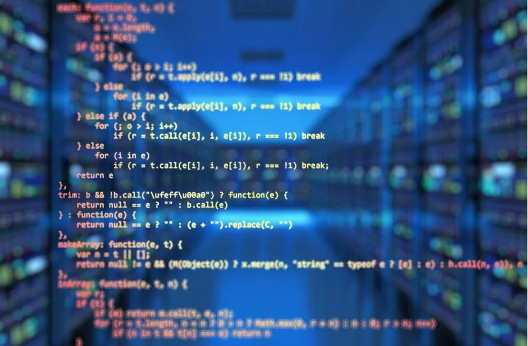

# PROJECTS
Hello this is my repository which contains various projects on various languages like 
HTML,CSS,JAVASCRIPT,JAVA,PYTHON,C and C++.

## License

[MIT](https://choosealicense.com/licenses/mit/)

## Authors

- [@Manmay Chakraborty](https://www.github.com/manmay2)

## 🚀 About Me
Hi, I am Manmay Chakraborty who is currently building up projects such as games,webpages,etc...on this repository.

## Feedback

If you have any feedback, please reach out to me at manmaychakarborty@gmail.com

## 🛠 Skills
Javascript, HTML, CSS,C,C++,PYTHON and JAVA

